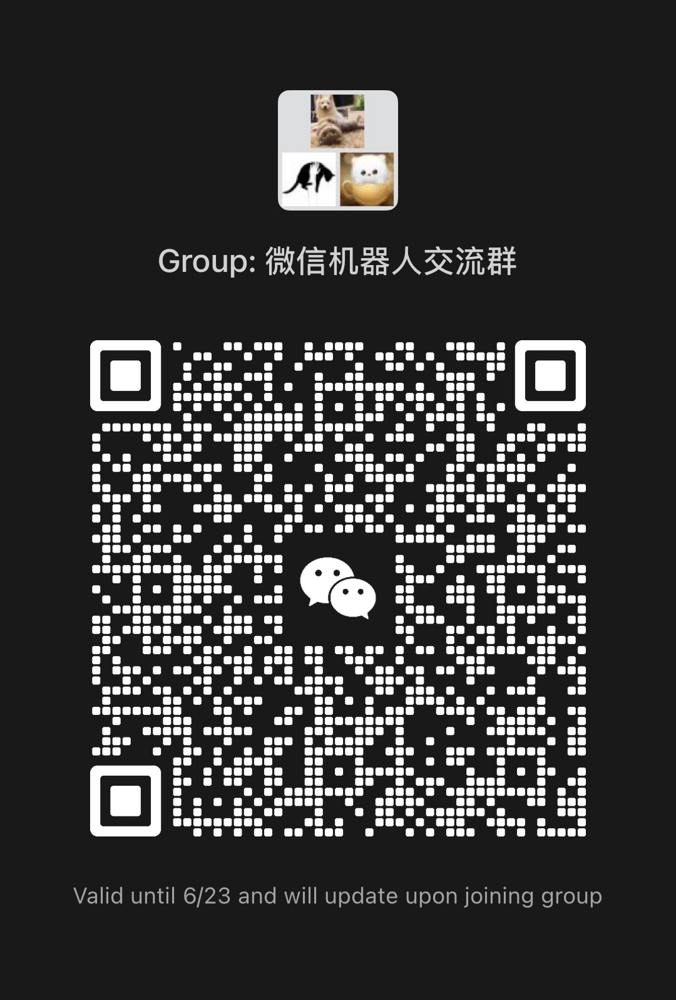

# 机器人客户端

## 免责声明

**本项目仅供学习交流使用，严禁用于商业用途**

使用本项目所产生的一切法律责任和风险，由使用者自行承担，与项目作者无关。

请遵守相关法律法规，合法合规使用本项目。

## 特别声明

**本项目仅部分源代码公开**

- 机器人管理后台

  - 前端项目: [https://github.com/hp0912/wechat-robot-admin-frontend](https://github.com/hp0912/wechat-robot-admin-frontend)

  - 后端项目: [https://github.com/hp0912/wechat-robot-admin-backend](https://github.com/hp0912/wechat-robot-admin-backend)

- 机器人客户端和服务端

  - 机器人客户端: [本项目](https://github.com/hp0912/wechat-robot-client)

  - 机器人服务端 **(源代码不公开)** [接口文档](ipad.swagger.yml)

- 公共服务

  - 公众号认证服务: [https://github.com/hp0912/wechat-server](https://github.com/hp0912/wechat-server) fork的项目，微信公众号的后端，为其他系统提供微信登录验证功能

  - 词云服务: [https://github.com/hp0912/word-cloud-server](https://github.com/hp0912/word-cloud-server) golang写的词云效果不太好，用python写了一个单独的服务

> 服务端采用iPad协议，可以去马老板开的动物园淘一淘

## 项目概览

本项目是一个智能机器人管理系统，提供了丰富的交互体验。

- AI聊天，chat-gtp deepseek qwen 系列等等。

- AI绘图，豆包文生图，智谱文生图

- AI语音，文本转语音，音色克隆。(开发中)

- 群聊欢迎新成员，支持文本、图片、表情包、链接形式

- 群聊退群提醒

- 群聊每日、每周、每月活跃排行榜，每日群聊词云

- 群聊每日总结

- 群聊每日早报

- 收藏夹 (待开发)

- 朋友圈，自动评论、点赞 (待开发)

## 使用方式

> 使用前的准备
>
> - 你得有自己的公众号，本项目只集成了公众号扫码登录
>
> - 自己会安装 docker 和 docker-compose

### 基础篇

#### 启动服务

```vim
# 克隆本项目
git clone git@github.com:hp0912/wechat-robot-client.git

# 进入部署目录
cd ./wechat-robot-client/.deploy/local

# 通过docker-compose启动容器，下面两个命令，哪个能用就用哪个
docker compose up -d
docker-compose up -d
```

#### 配置公众号认证服务

访问 http://127.0.0.1:8090 **微信服务器**

如何配置，前往 [https://github.com/hp0912/wechat-server](https://github.com/hp0912/wechat-server) 查看详细教程。

在**微信服务器** `设置` `个人设置` `生成访问令牌`生成的令牌，填入`docker-compose.yml`的`WECHAT_SERVER_TOKEN`的环境变量中，将你自己的公众号二维码链接填入`WECHAT_OFFICIAL_ACCOUNT_AUTH_URL`环境变量中。

重启服务

```
docker compose up -d
docker-compose up -d
```

### 进阶篇

TODO

## 官方交流群

